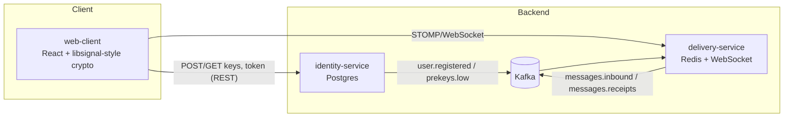

# CipherMesh architecture

## Services



## Sending an encrypted message (Alice → Bob)

```mermaid
sequenceDiagram
  participant A as Alice (client)
  participant I as identity-service
  participant D as delivery-service
  participant K as Kafka
  participant B as Bob (client)

  Note over B,I: Bob previously registered his public bundle
  A->>I: GET /v1/keys/bob/bundle
  I-->>A: identity + signed pre-key + one one-time key (consumed once)
  A->>A: X3DH → root key → ratchet; encrypt (Double Ratchet)
  A->>D: STOMP SEND /app/send { ciphertext }
  D->>K: publish messages.inbound
  K->>D: consume messages.inbound
  alt Bob online here
    D->>B: push /user/queue/messages
    B->>D: SEND /app/ack
    D->>K: publish messages.receipts
  else Bob offline
    D->>D: store in mailbox (Redis)
    Note over D,B: on reconnect, D drains mailbox → Bob
  end
```

The server only ever sees public keys and ciphertext. See the
[threat model](threat-model.md) and [ADR 0002](adr/0002-zero-knowledge-relay.md).
